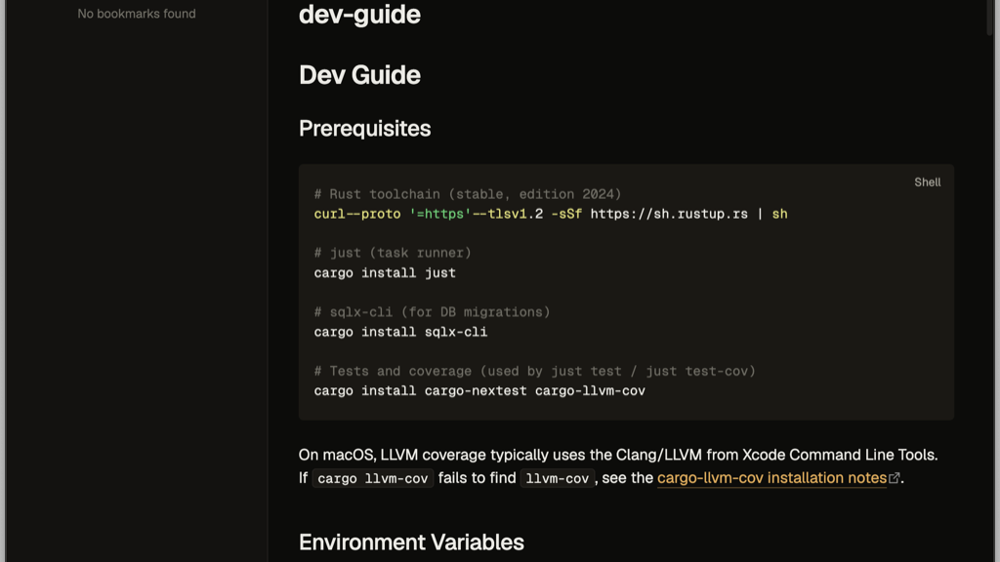

# Docgen — an Obsidian theme

A warm, near-black documentation theme for [Obsidian](https://obsidian.md),
modeled after the aesthetic of the **docgen** documentation generator
([docgen-rs](https://github.com/IamMaxim/docgen-rs)). Honey-amber accents on a
warm near-black surface, set in [Geist](https://vercel.com/font). Dark is the
primary mode; a light mode ships alongside it.

## Features

- **Warm near-black palette** with a honey-amber accent — easy on the eyes for
  long documentation sessions.
- **Geist + Geist Mono**, embedded directly in `theme.css` as base64 so the
  fonts render regardless of how Obsidian injects the stylesheet (no external
  font requests, works fully offline).
- **Dark and light modes**, both tuned from the same token set.

## Installation

### From the community themes directory (once published)

1. Open **Settings → Appearance → Themes → Manage**.
2. Search for **Docgen** and select **Install and use**.

### Manual installation

1. Download `manifest.json` and `theme.css` from the
   [latest release](https://github.com/IamMaxim/obsidian-docgen-theme/releases/latest).
2. In your vault, create the folder `.obsidian/themes/Docgen/` and place both
   files inside it.
3. Open **Settings → Appearance → Themes** and select **Docgen**.

## Development

`theme.css` is the single source of truth and is self-contained — the Geist
fonts are inlined, so no build step is required to use it. The original
`.woff2` sources live in `fonts/` for reference and re-embedding.

## Credits & license

- Theme CSS: [MIT](LICENSE) © Maxim Stepanov.
- [Geist](https://vercel.com/font) and Geist Mono fonts: © Vercel, Inc.,
  licensed under the [SIL Open Font License 1.1](LICENSE-Geist.txt).
